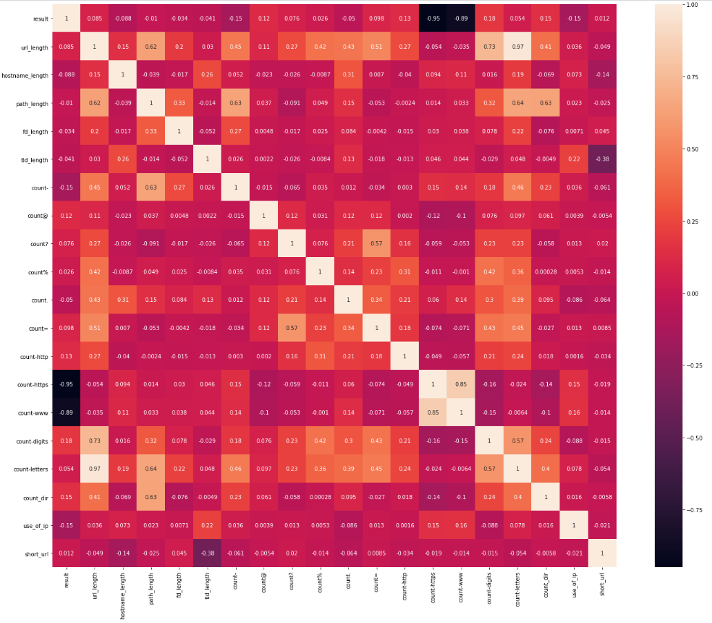
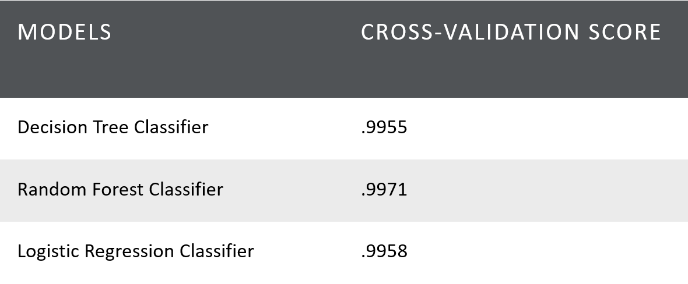
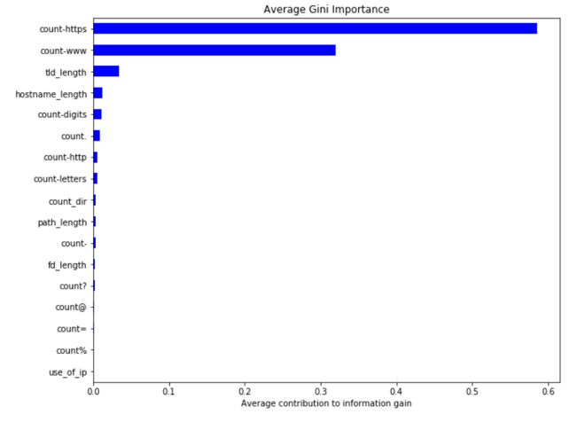
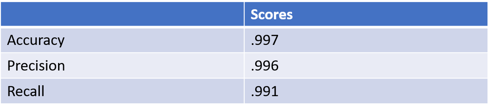

# Detecting-Malicious-URLs

## Plamen Dzhelepov
[Linkedin](https://www.linkedin.com/in/pdzhelepov) | [Github](https://github.com/plamengj)

## Table of Contents

* [Overview and Motivation](#overview-and-motivation)
* [Data](#data)
  * [Feature Extrction](#feature-extraction)
  * [Description](#description)
* [Exploration](#exploration)
* [Modeling](#modeling)
* [Conclusion](#conclusion)
* [Future Directions](#future-directions)

## Overview and Motivation
Malicious URLs are a common and serious threat to cybersecurity. Malicious URLs host unsolicited content (spam, phishing, drive-by downloads, etc.) and lure unsuspecting users to become victims of scams (monetary loss, theft of private information, and malware installation). These cause losses of billions of dollars every year. It is imperative to detect and act on such threats in a timely manner. Traditionally, this detection is done mostly through the usage of blacklists. However, blacklists cannot be exhaustive, and lack the ability to detect newly generated malicious URLs. Machine Learning techniques have been explored with increasing attention in recent years. This project aims to provide assessment of several Machine Learning models and how well they work in detecting Malicious URLs.

## Data
### Description
The data contains 400,000+ rows and two columns (an URL & whether it’s malicious or not) that translates to 400,000+ observations and 1 feature (the URL itself). The ratio of benign to malicious URLs is 3:1 in the dataset. I have used pandas and dataframes to examine, plot and analyze this data.

## Feature Extraction
I managed to extract 17 features out of the URL.

## Exploration
This section contains plots that demonstrate the types of information that can be gleaned from this data set.

This is a heatmap of the correlation matrix and it shows how the features are correlated with each other and with the target.

## Modeling

Based on those cross-validation score. I chose as my model the Random forest and scored it on the testing set. 

These are the feature importances:

And these are the scores:

<!-- And the confusion matrix:

 -->

## Conclusions
Random Forest performed best with 99.7% accuracy in determining if a URL is malicious or not. The lack of “https” and “www” in the URL are strong indicators that a URL is malicious
